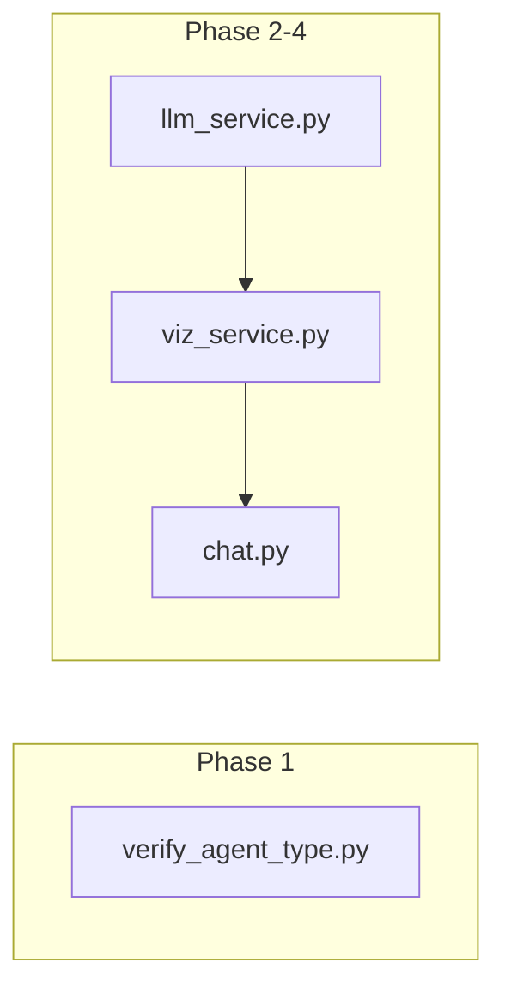

# 大模型交互 BUG 修复计划（分 Phase 版）

## 问题现象

用户提问「各部门的销售对比」时，聊天界面显示内部工具调用文本，而非自然语言回答：

```
functions.sql_db_list_tables:0 RVAGQJKAKLN{ "tool_input": ""}
functions.sql_db_list_tables:1 RVAGQJKAKLN{ "tool_input": ""}
```

图表区域始终为「暂无图表」。HTTP 返回 200，问题在后端逻辑。

---

## 根因与可选方案


| 因素       | 说明                                                      |
| -------- | ------------------------------------------------------- |
| Agent 类型 | `agent_type="openai-tools"` 依赖 LLM 正确返回结构化 `tool_calls` |
| Kimi 兼容性 | moonshot-v1-8k 对 OpenAI 工具调用格式支持可能不完整                   |
| 输出来源     | `result["output"]` 混入工具调用文本时，会直接展示给用户                   |


**可选方案**：

- **方案 A**：切换 `agent_type` 为 `"zero-shot-react-description"`（ReAct，不依赖工具调用）
- **方案 B**：保持 `openai-tools`，在输出侧做正则清洗（`sanitize_agent_output`）
- **方案 C**：方案 A + 方案 B 组合（主修复 + 兜底）

---

## Phase 1：方案验证（确定主方案）

**目标**：在本项目环境（Kimi + langchain-community）下，验证哪种 agent_type 能返回正常自然语言。

**产出**：新增 `backend/scripts/verify_agent_type.py`，对以下两类分别做一次调用并比较输出：

1. `agent_type="openai-tools"`（当前配置）
2. `agent_type="zero-shot-react-description"`（ReAct 模式）

**验证逻辑**：

```python
# 伪代码
for agent_type in ["openai-tools", "zero-shot-react-description"]:
    agent = create_sql_agent(llm=..., db=..., agent_type=agent_type, verbose=True)
    result = agent.invoke({"input": "各部门的销售对比"})
    output = result.get("output", str(result))
    has_tool_garbage = "functions.sql_db_" in output or "tool_input" in output
    print(f"{agent_type}: has_tool_garbage={has_tool_garbage}, len={len(output)}")
```

**结论规则**：

- 若 `zero-shot-react-description` 输出无工具调用垃圾，且回答合理 → **主方案选 A**（切换 agent_type）
- 若 `openai-tools` 仍含垃圾、`zero-shot-react-description` 正常 → **主方案选 A**
- 若两者均有少量垃圾 → **主方案选 C**（A + B 组合）
- 若 `zero-shot-react-description` 报错或不兼容 → **主方案选 B**（仅输出清洗）

**执行**：`cd backend && python scripts/verify_agent_type.py`

---

## Phase 2：主修复（切换 Agent 类型）

**前置条件**：Phase 1 结论为「主方案 A 或 C」。

**修改文件**：[backend/app/services/llm_service.py](backend/app/services/llm_service.py)

**修改内容**：

```python
# 修改前
agent_type="openai-tools",

# 修改后（langchain-community 支持该字符串）
agent_type="zero-shot-react-description",
```

若验证脚本中发现需使用 `None` 或其他枚举值，则按实际可用值修改。

---

## Phase 3：兜底加固（输出清洗）

**目标**：无论 Phase 2 是否切换 agent_type，均增加输出清洗，防止未来模型/API 变化再次暴露工具调用文本。

**修改文件**：[backend/app/services/viz_service.py](backend/app/services/viz_service.py)

在 `parse_chart_from_response` 的**入口**对 `full_response` 做清洗：

```python
import re

TOOL_CALL_PATTERN = re.compile(
    r"functions\.sql_db_\w+:\d+\s*\S*\{[^}]*\"tool_input\"[^}]*\}",
    re.MULTILINE,
)

def sanitize_agent_output(text: str) -> str:
    """移除 LangChain 工具调用的原始输出，避免展示给用户"""
    return TOOL_CALL_PATTERN.sub("", text).strip()
```

在 `parse_chart_from_response` 首行调用：

```python
def parse_chart_from_response(full_response: str) -> tuple[str, dict | None]:
    full_response = sanitize_agent_output(full_response)
    # ... 后续逻辑不变
```

---

## Phase 4：端到端验证与收尾

**验证用例**：


| 用例   | 输入          | 预期                               |
| ---- | ----------- | -------------------------------- |
| 数据查询 | 「各部门的销售对比」  | 自然语言总结 + 右侧图表                    |
| 趋势查询 | 「近三个月销售额趋势」 | 文字回答 + 可选图表                      |
| 简单问候 | 「你好」        | 合理回复，无 SQL 调用                    |
| 异常防护 | （若故意构造）     | 不出现 `functions.sql_db_*` 等工具调用文本 |


**验收标准**：

- 回答为自然语言，无工具调用痕迹
- 涉及对比/趋势时图表可渲染
- 问候类问题不触发 SQL，回答自然

---

## 关键文件与数据流




| 文件                                                                         | 职责                                                   |
| -------------------------------------------------------------------------- | ---------------------------------------------------- |
| [backend/app/services/llm_service.py](backend/app/services/llm_service.py) | Agent 创建、invoke、返回 output                            |
| [backend/app/services/viz_service.py](backend/app/services/viz_service.py) | 解析 [CHART]、输出清洗                                      |
| [backend/app/api/chat.py](backend/app/api/chat.py)                         | SSE 流式接口，调用 invoke_agent 与 parse_chart_from_response |


