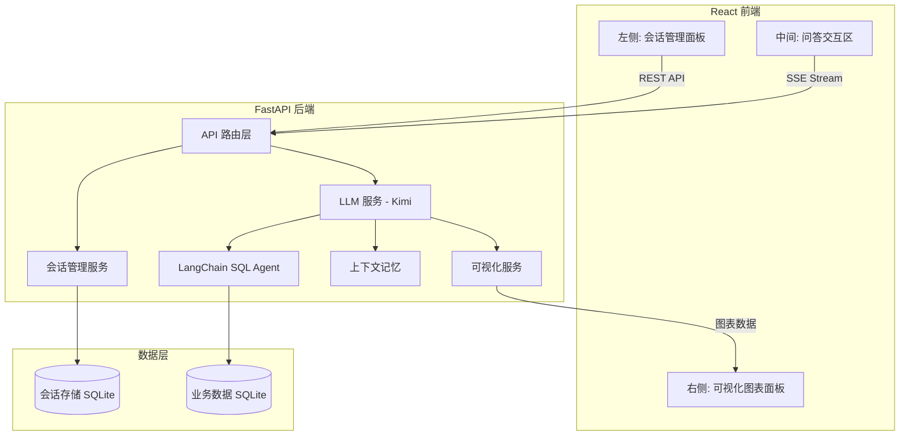

# 智能数据分析系统 (SmartDataAssistant) - 分阶段开发计划

## 系统架构总览




## 项目目录结构

```
SmartDataAssistant/
├── backend/
│   ├── app/
│   │   ├── __init__.py
│   │   ├── main.py                 # FastAPI 入口, CORS, 路由注册
│   │   ├── config.py               # 环境变量配置
│   │   ├── database/
│   │   │   ├── __init__.py
│   │   │   ├── connection.py       # SQLite 连接管理
│   │   │   ├── models.py           # SQLAlchemy ORM 模型
│   │   │   └── seed.py             # 示例数据填充脚本
│   │   ├── services/
│   │   │   ├── __init__.py
│   │   │   ├── llm_service.py      # Kimi LLM + LangChain SQL Agent
│   │   │   ├── session_service.py  # 会话 CRUD 管理
│   │   │   └── viz_service.py      # 图表数据生成服务
│   │   ├── api/
│   │   │   ├── __init__.py
│   │   │   ├── chat.py             # 聊天 API (SSE 流式)
│   │   │   └── session.py          # 会话管理 API
│   │   └── schemas/
│   │       ├── __init__.py
│   │       └── chat.py             # Pydantic 请求/响应模型
│   ├── data/                       # SQLite 数据库文件目录
│   ├── .env                        # API Key 等环境变量
│   └── requirements.txt
├── frontend/
│   ├── src/
│   │   ├── components/
│   │   │   ├── Layout/
│   │   │   │   └── MainLayout.tsx
│   │   │   ├── ChatSidebar/
│   │   │   │   └── ChatSidebar.tsx
│   │   │   ├── ChatArea/
│   │   │   │   ├── ChatArea.tsx
│   │   │   │   ├── MessageList.tsx
│   │   │   │   ├── MessageItem.tsx
│   │   │   │   └── InputArea.tsx
│   │   │   └── Visualization/
│   │   │       └── ChartPanel.tsx
│   │   ├── services/
│   │   │   └── api.ts
│   │   ├── store/
│   │   │   └── chatStore.ts
│   │   ├── types/
│   │   │   └── index.ts
│   │   ├── App.tsx
│   │   └── main.tsx
│   ├── package.json
│   └── vite.config.ts
└── README.md
```

---

## Phase 1: 基础框架搭建与环境验证

> 目标: 前后端项目能独立启动运行，数据库就绪，为后续开发打好地基。

### 1.1 后端环境

- 创建 conda 环境 `smart-data`，Python 3.11
- 配置 pip 清华镜像源 (`https://pypi.tuna.tsinghua.edu.cn/simple`)
- `backend/requirements.txt` 依赖清单:

```
fastapi==0.115.6
uvicorn[standard]==0.34.0
langchain==0.3.14
langchain-openai==0.3.0
langchain-community==0.3.14
sqlalchemy==2.0.36
python-dotenv==1.0.1
pandas==2.2.3
matplotlib==3.10.0
sse-starlette==2.2.1
pydantic==2.10.4
aiosqlite==0.20.0
```

### 1.2 后端骨架

- `app/main.py`: FastAPI 实例 + CORS 中间件 + 路由挂载 + 启动事件(初始化数据库)
- `app/config.py`: 使用 pydantic-settings 读取 `.env` 配置
- `app/database/connection.py`: SQLAlchemy async engine + session
- `app/database/models.py`: 业务表 (departments, employees, products, sales_records) + 会话表 (sessions, messages) 的 ORM 模型
- `app/database/seed.py`: 填充 200+ 条示例数据
- 健康检查接口 `GET /health` 返回 `{"status": "ok"}`

### 1.3 数据库设计

业务数据 4 张表:

- **departments**: id, name, manager, budget
- **employees**: id, name, department_id(FK), position, salary, hire_date
- **products**: id, name, category, price, stock
- **sales_records**: id, product_id(FK), employee_id(FK), quantity, amount, sale_date

会话数据 2 张表:

- **sessions**: id, title, created_at, updated_at
- **messages**: id, session_id(FK), role(user/assistant), content, chart_data(JSON), created_at

### 1.4 前端初始化

- `npm create vite@latest frontend -- --template react-ts`
- 安装依赖: `antd`, `@ant-design/icons`, `echarts`, `echarts-for-react`, `axios`, `zustand`, `react-markdown`
- `vite.config.ts` 配置 proxy: `/api` -> `http://localhost:8000`

### 1.5 验收标准

- 后端 `uvicorn app.main:app --reload --port 8000` 启动成功
- 访问 `http://localhost:8000/health` 返回 OK
- 访问 `http://localhost:8000/docs` 看到 Swagger 文档
- 前端 `npm run dev` 启动成功，页面正常显示

---

## Phase 2: 前端 UI 开发

> 目标: 完成全部 UI 组件开发，使用 Mock 数据驱动，界面美观交互流畅。

### 2.1 类型定义与状态管理

`types/index.ts`:

```typescript
interface Session {
  id: string;
  title: string;
  created_at: string;
  updated_at: string;
}

interface Message {
  id: string;
  session_id: string;
  role: 'user' | 'assistant';
  content: string;
  chart_data?: EChartsOption | null;
  created_at: string;
}
```

`store/chatStore.ts`: Zustand store 管理 sessions/messages/charts/isStreaming 状态，先用 Mock 实现全部 actions。

### 2.2 三栏布局

`MainLayout.tsx`: 使用 antd Layout 或 CSS Flex 实现:

```
+------------------+------------------------+--------------------+
|  ChatSidebar     |      ChatArea          |   ChartPanel       |
|  宽度: 250px      |    flex: 1 自适应       |   宽度: 400px       |
|  左侧固定         |    中间填充             |   右侧固定           |
+------------------+------------------------+--------------------+
```

### 2.3 左侧 ChatSidebar

- 顶部: "新建对话" 按钮 (antd Button)
- 会话列表: 按更新时间排序，选中态高亮
- 会话操作: hover 显示操作图标 (重命名/删除)
- 底部: 系统信息或设置入口

### 2.4 中间 ChatArea

- **MessageList**: 消息列表，自动滚动到底部
- **MessageItem**: 区分用户(右侧蓝色气泡)和 AI(左侧白色气泡)，AI 消息支持 Markdown 渲染 (`react-markdown`)
- **InputArea**: 底部输入框 + 发送按钮，支持 Enter 发送 / Shift+Enter 换行
- 流式状态: AI 回复时显示光标闪烁动画

### 2.5 右侧 ChartPanel

- 当前图表: 使用 `echarts-for-react` 渲染最新图表
- 图表历史: 当前会话产生的所有图表缩略图列表，点击可切换显示
- 空状态: 无图表时显示友好占位图
- 操作: 全屏查看、下载为图片

### 2.6 验收标准

- 使用 Mock 数据展示多个会话、多条消息、多个图表
- 切换会话时消息和图表联动更新
- UI 风格统一美观，响应式适配

---

## Phase 3: 后端接口开发

> 目标: 实现全部后端 API，包括会话管理、LLM 对话、SQL 查询、可视化生成。

### 3.1 会话管理 API (`api/session.py`)


| 方法     | 路径                 | 功能          |
| ------ | ------------------ | ----------- |
| POST   | /api/sessions      | 创建新会话       |
| GET    | /api/sessions      | 获取会话列表      |
| GET    | /api/sessions/{id} | 获取会话详情(含消息) |
| PUT    | /api/sessions/{id} | 重命名会话       |
| DELETE | /api/sessions/{id} | 删除会话        |


### 3.2 LLM 服务 (`services/llm_service.py`)

核心链路:

```python
# 1. Kimi LLM 初始化
llm = ChatOpenAI(
    model="moonshot-v1-8k",
    openai_api_key=KIMI_API_KEY,
    openai_api_base="https://api.moonshot.cn/v1",
    temperature=0.3,
)

# 2. SQL Database 工具
db = SQLDatabase.from_uri("sqlite:///./data/smart_data.db")

# 3. SQL Agent (含可视化指令的 system prompt)
agent = create_sql_agent(llm=llm, db=db, agent_type="openai-tools", verbose=True)
```

System prompt 要点:

- 注入数据库表结构描述
- 要求只执行 SELECT 查询 (安全)
- 要求判断结果是否适合可视化
- 若适合，在回答末尾附带 `[CHART]...[/CHART]` 包裹的 ECharts option JSON

### 3.3 上下文记忆 (`services/llm_service.py`)

- 每次请求前从 messages 表加载当前会话最近 N 条消息
- 构建 LangChain message history: `HumanMessage` / `AIMessage`
- 注入到 Agent 的调用中作为 chat_history

### 3.4 可视化服务 (`services/viz_service.py`)

- 解析 LLM 回答中的 `[CHART]...[/CHART]` 标记
- 提取并校验 JSON 格式
- 补全 ECharts option 默认配置 (tooltip, legend, 响应式等)
- 分离纯文字回答和图表数据

### 3.5 聊天流式接口 (`api/chat.py`)

```
POST /api/chat/stream
Body: { "session_id": "xxx", "message": "各部门销售额对比" }
Response: SSE stream
  event: message  data: {"content": "根据查询..."}  (多次推送)
  event: chart    data: {"option": {...echarts config...}}
  event: done     data: {"message_id": "xxx"}
```

### 3.6 配置文件 `backend/.env`

```
KIMI_API_KEY=your_api_key_here
KIMI_MODEL=moonshot-v1-8k
KIMI_BASE_URL=https://api.moonshot.cn/v1
DATABASE_URL=sqlite:///./data/smart_data.db
SESSION_DB_URL=sqlite:///./data/sessions.db
CONTEXT_WINDOW_SIZE=10
```

### 3.7 验收标准

- 会话 CRUD API 全部可通过 Swagger 测试
- 发送自然语言问题能返回 SQL 查询结果
- 涉及数据对比/趋势的问题能返回 ECharts 图表 JSON
- 上下文记忆: 连续追问能理解上文语境

---

## Phase 4: 前后端联调

> 目标: Mock 数据替换为真实 API，SSE 流式渲染就绪，端到端跑通完整链路。

### 4.1 API 服务层对接 (`services/api.ts`)

- 封装 axios 实例 (baseURL, 拦截器)
- 会话 API: `createSession()`, `getSessions()`, `getSessionMessages()`, `deleteSession()`, `renameSession()`
- SSE 流式: 使用 `fetch` + `ReadableStream` 读取 SSE 事件

### 4.2 Store 绑定真实 API

- Zustand store 中的 actions 从 Mock 改为调用 `api.ts`
- `sendMessage()` 改为 SSE 流式接收，逐步更新 messages 状态
- 收到 `chart` 事件时追加到 charts 状态

### 4.3 流式渲染联调

- AI 消息实时追加文字 (打字机效果)
- 图表数据到达时右侧面板实时渲染 ECharts
- 流式期间禁用输入框、显示 loading 状态

### 4.4 端到端测试场景

- "查询所有部门的员工人数" -> 表格数据 + 柱状图
- "最近3个月的销售趋势" -> 趋势描述 + 折线图
- "各产品类别的销售占比" -> 占比分析 + 饼图
- 连续追问: "上面的数据中哪个最高？" -> 基于上下文回答

### 4.5 体验优化

- 网络错误/LLM 超时的友好提示
- 空会话引导页
- 消息发送中的 loading 骨架屏
- 图表加载动画
- 首次使用时的自动创建会话

### 4.6 验收标准

- 完整链路: 输入自然语言 -> 看到流式文字回复 + 右侧图表渲染
- 会话管理: 新建/切换/删除会话正常
- 上下文: 连续对话能理解上下文
- 无控制台报错，交互流畅

